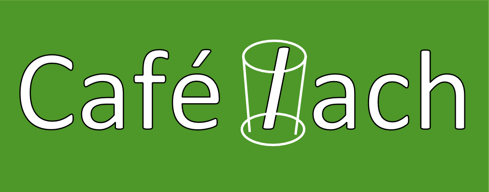

<h2><u>User Centric Frontend Development Milestone Project</u></h2>

Café Iach is a small family-run business based in the heart of Cardiff. "Iach" is the Welsh word for "health", or "healthy", and the aim of the business is to offer an alternative to the usual greasy spoon type Café which is usually found in the UK. The venue hosts live music events once a month.

Colour pallette - GREEN
"Green is motivating" - <a href="https://www.verywellmind.com/color-psychology-green-2795817">https://www.verywellmind.com/color-psychology-green-2795817</a>

 

Technologies Used
<li>HTML5
<li>CSS3
<li>Bootstrap Version 4.3 - used for responsive layout
<li>Fontawesome v v5.0.10 - for font symbols.</li>

 

<h3><b>Pages and sections</b></h3>
<li>Home Page - banner image, videa, and "About Us" information section</li>
<li>Live Music - a tabulated list of upcoming live music events in 2022.</li>
<li>Menu - Download a PDF of the menu from the top menu bar.</li>
<li>Reviews - Polling score card -  <a href="https://www.w3schools.com/howto/howto_css_user_rating.asp">taken from w3schools webpage on scorecards</a>  </li>
<li>Contact Us - HTML form with sections on - Name, Email and Query.</li>

 

<a href="../assets/read-docs/OW.pdf" target="_blank">(Original Wireframe)</a>

 

<a href="../assets/read-docs/Personas.pdf" target="_blank">(Personas)</a>
